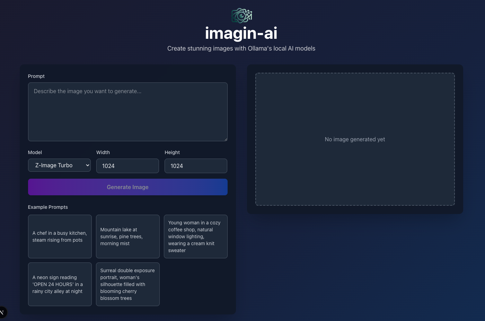
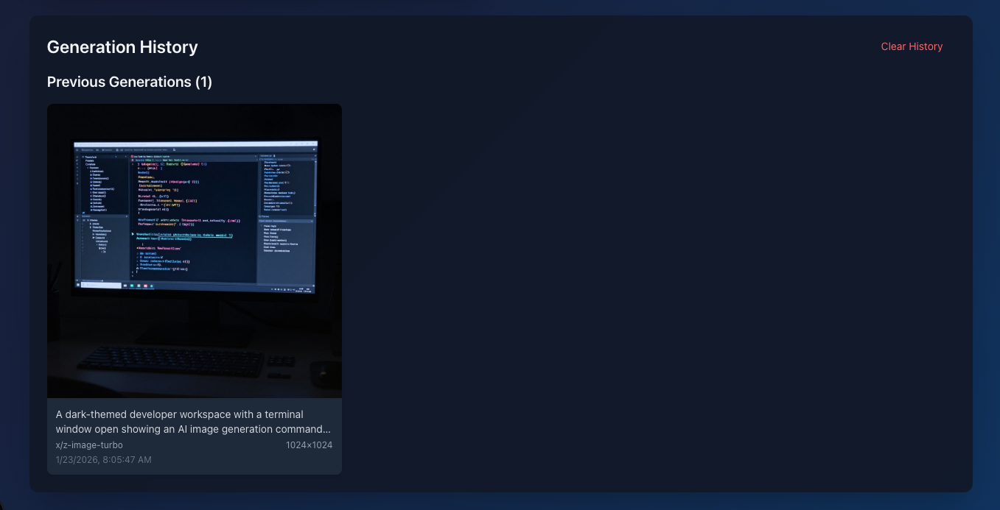

<p align="center">
  <a href="https://github.com/d3communityofficial/imagin-ai" target="_blank" rel="noopener noreferrer">
    
  </a>
</p>

<p align="center">Create stunning images with Ollama's local AI models</p>

<p align="center">
  <a href="https://github.com/d3communityofficial/imagin-ai" target="_blank" rel="noopener noreferrer"></a>
  <a href="https://github.com/d3communityofficial/imagin-ai/issues" target="_blank" rel="noopener noreferrer"></a>
  <a href="https://github.com/d3communityofficial/imagin-ai/blob/main/LICENSE" target="_blank" rel="noopener noreferrer"></a>
  <a href="https://nextjs.org" target="_blank" rel="noopener noreferrer"></a>
</p>

## Features

### 🎨 Stream Image Generation

Generate images in real-time with streaming support. Watch your creations come to life as they're generated.

### 🖼️ Image Gallery

Automatically save and organize your generated images in a beautiful gallery interface. Browse through your creation history with ease.

### 🚀 Local AI Processing

Run everything locally using Ollama - no external API keys required. Your data stays on your machine.

### ⚡ Real-time Progress

Track image generation progress with live updates and progress indicators.

### 🎯 Model Selection

Choose from available Ollama image generation models optimized for quality and speed.

## Screenshots

### Main Interface

<p align="center">
  
</p>

### Image Gallery

<p align="center">
  
</p>

## Quickstart

### Prerequisites

- **Node.js** v20 or higher
- **npm**, **yarn**, **pnpm**, or **bun** package manager
- **Ollama** installed and running (see installation steps below)

> **Note:** Ollama image generation is currently only supported on **macOS**. Support for other operating systems is coming soon.

### Installation

1. **Install Ollama**

   Visit [ollama.ai](https://ollama.ai) and download the installer for macOS, or install via Homebrew:

   ```bash
   brew install ollama
   ```

   Start the Ollama service:

   ```bash
   ollama serve
   ```

   Keep this terminal window open while using imagin-ai.

2. **Pull the Image Generation Model**

   Pull the required image generation model:

   ```bash
   ollama pull x/z-image-turbo
   ```

   This will download the model (it may take a few minutes depending on your internet connection).

3. **Clone and Install the Project**

   ```bash
   git clone https://github.com/d3communityofficial/imagin-ai.git
   cd imagin-ai
   npm install
   # or
   yarn install
   # or
   pnpm install
   # or
   bun install
   ```

4. **Start the Development Server**

   ```bash
   npm run dev
   # or
   yarn dev
   # or
   pnpm dev
   # or
   bun dev
   ```

5. **Open the Application**

   Open [http://localhost:3000](http://localhost:3000) in your browser.

## Usage

1. **Enter a Prompt**: Type a descriptive prompt for the image you want to generate
2. **Select Model**: Choose the image generation model (default: Z-Image Turbo)
3. **Generate**: Click the generate button and watch your image stream in real-time
4. **Save**: Generated images are automatically saved to your gallery
5. **Browse**: View and manage your image history in the gallery section

## Project Structure

```
imagin-ai/
├── app/
│   ├── api/
│   │   └── generate/
│   │       └── stream/          # Streaming image generation API
│   ├── components/              # React components
│   │   ├── Gallery.tsx          # Image gallery component
│   │   ├── ImageDisplay.tsx     # Image display component
│   │   ├── ModelSelector.tsx    # Model selection dropdown
│   │   ├── PromptInput.tsx      # Prompt input form
│   │   └── ...
│   ├── hooks/                   # Custom React hooks
│   │   ├── useImageHistory.ts   # Image history management
│   │   └── useStreamingImageGeneration.ts  # Streaming generation logic
│   ├── types/                   # TypeScript type definitions
│   ├── utils/                   # Utility functions
│   │   ├── stream/              # Streaming utilities
│   │   ├── transform.ts         # Data transformation
│   │   └── ...
│   └── page.tsx                 # Main page component
├── public/                      # Static assets
├── .github/                     # GitHub configuration
│   ├── CODE_OF_CONDUCT.md
│   └── CONTRIBUTING.md
└── package.json
```

## Tech Stack

- **Framework**: [Next.js](https://nextjs.org/) 16.1.4 (App Router)
- **Language**: [TypeScript](https://www.typescriptlang.org/)
- **UI**: [Tailwind CSS](https://tailwindcss.com/)
- **AI**: [Ollama](https://ollama.ai/) for local image generation
- **Runtime**: Node.js v20+

## Troubleshooting

### Ollama Connection Issues

If you're experiencing connection issues with Ollama:

1. **Verify Ollama is Running**:
   ```bash
   ollama list
   ```
   This should show your installed models. If it doesn't work, make sure Ollama is running.

2. **Check Ollama Service**:
   ```bash
   curl http://localhost:11434/api/tags
   ```
   This should return a JSON response with your models.

3. **Restart Ollama**:
   ```bash
   # Stop Ollama (Ctrl+C in the terminal where it's running)
   # Then restart:
   ollama serve
   ```

### Model Not Found

If you get an error about the model not being found:

```bash
ollama pull x/z-image-turbo
```

Verify the model is installed:

```bash
ollama list
```

### Port Already in Use

If port 3000 is already in use, you can change it:

```bash
npm run dev -- -p 3001
# or
PORT=3001 npm run dev
```

Then open [http://localhost:3001](http://localhost:3001)

### Image Generation Fails

- Ensure Ollama is running and accessible at `http://localhost:11434`
- Verify the model `x/z-image-turbo` is installed
- Check that you're on macOS (currently required for image generation)
- Review browser console for any error messages

## Development

### Running Linting

```bash
npm run lint
# or
yarn lint
# or
pnpm lint
```

### Building for Production

```bash
npm run build
npm start
```

## Contributing

We welcome contributions! Please see our [Contributing Guide](.github/CONTRIBUTING.md) for details on how to get started.

Before contributing, please read our [Code of Conduct](.github/CODE_OF_CONDUCT.md).

## License

This project is licensed under the Apache License 2.0 - see the [LICENSE](LICENSE) file for details.

## Acknowledgments

- [Ollama](https://ollama.ai/) for providing local AI model capabilities
- [Next.js](https://nextjs.org/) for the amazing framework
- All contributors who help make this project better

<p align="center">Made with ❤️ by the imagin-ai community</p>
